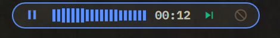
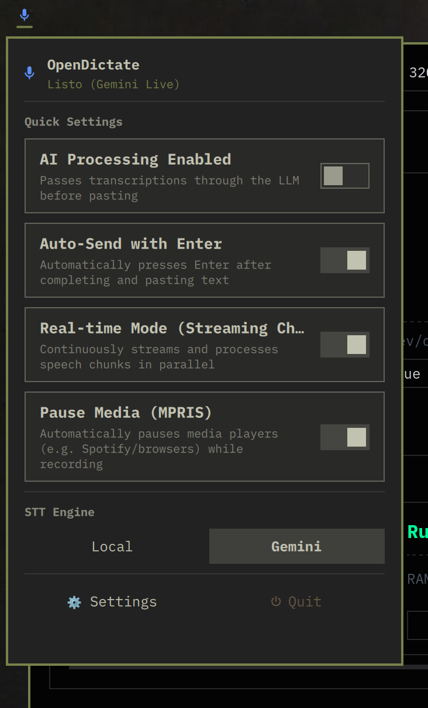

<div align="center">
  
  <h1>OpenDictate</h1>
  <p><strong>Privacy-First, Global Voice Dictation & STT Daemon for Linux</strong></p>
  <br>
  
  <p><em>OpenDictate active recording indicator in Omarchy top bar</em></p>
  <br>
  
  <p><em>Quick status and control popup panel</em></p>
</div>

<hr>

> [!NOTE]
> **Platform & Development Focus**: Active development is now focused on **Arch Linux & Omarchy (Hyprland + Quickshell)**. The GNOME Shell extension and Ubuntu/Debian-specific workflows are now frozen in maintenance mode. Future features prioritize Wayland/Hyprland, Arch-based packaging, native D-Bus IPC, and Quickshell plugin integrations.

OpenDictate is an omnipresent, background voice dictation daemon and IPC service for Linux desktop environments. Built with a strict privacy-first philosophy, it leverages local on-device transcription to act as a system-wide microphone layer. It allows you to dictate text directly into any focused window—or feed headless voice transcripts directly into third-party applications via D-Bus—without sending your voice audio to external servers unless explicitly configured.

---

## 🛡️ Core Philosophy: Privacy & Local Processing

The primary objective of OpenDictate is to guarantee that your voice data never leaves your machine. 
All audio capture, Voice Activity Detection (VAD), and speech-to-text inference are handled 100% locally using **`faster-whisper`** (CTranslate2). 

*While OpenDictate offers optional Cloud STT (Gemini Live) and AI rewriting features, the core transcription engine is entirely local, private, and independent of any internet connection.*

---

## 🚀 Key Features

* **100% Local Voice Recognition**: Powered by localized Whisper models running on CPU/CUDA via `faster-whisper`.
* **Adaptive VAD Dynamic Chunking**: Intelligent real-time voice activity detection that segments audio during natural conversational pauses (`0.6s` default), with continuous ambient noise floor tracking, retroactive boundary search, and energy-valley fallback to eliminate word truncation and hallucinations.
* **Omarchy Shell Native Plugin (Quickshell / QML)**:
  * Top bar status widget with live audio level waveforms and pulse animations.
  * Bar position configuration (Left, Center, Right) directly from settings.
  * Visual badge and accent customization when dictation is reserved for external apps.
  * Comprehensive modal Settings dialog with backdrop click protection.
* **Headless D-Bus Session API (`org.kirulab.OpenDictate`)**:
  * Seamless integration for 3rd-party applications without focus stealing or clipboard hijacking.
  * **Dictation Reservation (`ReserveCaptureSession`)**: External apps can queue the next dictation with custom accent colors and application names.
  * **Multi-App Eviction & Client UUIDs**: Clean displacement and cancellation signaling (`SessionCancelled`, `SessionReservationReleased`) when new client requests arrive.
  * **Smart Double-Cancellation**: Cancelling mid-recording discards corrupted audio while keeping the active app reservation armed for an immediate retry.
* **Alternative Cloud STT (Gemini Live)**: Bidirectional streaming STT via Google Gemini Live API (`gemini-3.5-transcribe-live`) with real-time speculative interim hypotheses and SMART semantic punctation.
* **Per-App AI Profiles**: Configure custom System Prompts and vision context tailored to specific window classes (e.g. Markdown for Obsidian, Bash commands for terminal emulators).
* **Smart Window Focus Restoration (Hyprland & Wayland)**: Restores the exact prior window focus via Hyprland Lua socket dispatch before pasting, preventing cross-app paste errors during multitasking.
* **Smart Media Control**: Automatically hooks into MPRIS via D-Bus to pause media players (Spotify, VLC, YouTube) when you speak, and resumes playback upon completion.
* **OpenDeck & Stream Deck Hardware Integration**: Native OpenDeck plugin with physical button controls and dynamic feedback.
* **Full Multi-Language Localization (`i18n`)**: English (`en`), Spanish (`es`), German (`de`), and French (`fr`).

---

## 🏗️ Architecture & IPC

OpenDictate utilizes a hybrid IPC architecture for maximum flexibility:

1. **Unix Domain Socket (`/tmp/opendictate.socket`)**: Fast, low-overhead local client commands and GUI triggers.
2. **D-Bus Interface (`org.kirulab.OpenDictate` on Session Bus)**: Headless external application integration.

### D-Bus Interface Reference

| Method | Arguments | Returns | Description |
|---|---|---|---|
| `ReserveCaptureSession` | `a{sv} options` (`session_id`, `app_name`, `accent_color`, `ai_processing`, `ai_prompt`) | `s session_id` | Arms OpenDictate to deliver the next user dictation to the calling app with custom bar styling. |
| `ReleaseReservedSession` | `s session_id` | *(none)* | Releases an armed reservation from the queue. |
| `StartCaptureSession` | `a{sv} options` | `s session_id` | Immediately initiates headless audio recording. |
| `StopCaptureSession` | `s session_id` | *(none)* | Stops recording and transcribes audio without pasting or stealing focus. |
| `CancelCaptureSession` | `s session_id` | *(none)* | Cancels capture and releases reservation. |
| `GetStatus` | *(none)* | `s status_json` | Returns JSON status (state, active session, reserved session, model, backend). |

| Signal | Arguments | Description |
|---|---|---|
| `SessionReserved` | `s session_id, s app_name, s accent_color` | Emitted when an app reserves the next dictation. |
| `SessionReservationReleased` | `s session_id` | Emitted when a reservation is cleared. |
| `SessionStarted` | `s session_id` | Emitted when audio recording begins. |
| `SessionFinished` | `s session_id, s raw_text, s processed_text, s status` | Delivers finalized transcription text to the client. |
| `SessionCancelled` | `s session_id` | Emitted if recording was cancelled or evicted. |
| `InterimText` | `s session_id, s interim_text` | Emitted during real-time streaming speech. |

---

## 📦 Installation

### Arch Linux / Omarchy Package (`.pkg.tar.zst`)
Download the latest `.pkg.tar.zst` from Releases and install via `pacman`:
```bash
sudo pacman -U opendictate-1.2.0.nightly.20260902-1-any.pkg.tar.zst
```

### Ubuntu / Debian Package (`.deb`) *(Maintenance Mode)*
```bash
sudo dpkg -i opendictate_1.2.0-nightly.20260902_all.deb || sudo apt-get install -f -y
```

### Local User Installation (Development / Source)
```bash
git clone https://github.com/ThePartyAcolyte/opendictate.git
cd opendictate
./install.sh
```

---

## ⌨️ CLI / Global Shortcuts

Bind these commands to your compositor or window manager shortcuts (e.g. `hyprland.conf`):

```ini
# Example Hyprland binding (SUPER + D)
bind = $mainMod, D, exec, opendictate --toggle-record-send
```

| Command | Action |
|---|---|
| `opendictate --toggle-record-send` | Push once to start recording. Push again to stop, apply optional AI cleaning, and inject text. |
| `opendictate --record` | Starts recording (or resumes if paused). |
| `opendictate --pause` | Pauses current recording without sending. |
| `opendictate --cancel` | Cancels recording / discards audio buffer (or releases armed app reservation if in IDLE). |
| `opendictate --send` | Injects current transcript into the active window. |
| `opendictate --settings` | Opens the Settings Panel. |
| `opendictate --set-bar-position <left\|center\|right>` | Relocates the Omarchy top bar widget. |

---

## ⚖️ License and Credits

* **License**: Released under the MIT License. Copyright (c) 2026 Kirulab / Tomás D. López.
* Core engine powered by `faster-whisper` (MIT) and Google Gemini Live API.
