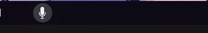
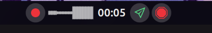
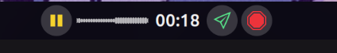
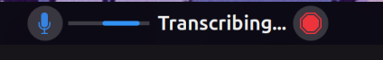
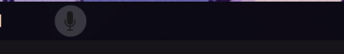

# OpenDictate

A powerful and versatile local dictation assistant for Linux (Wayland/X11) powered by `faster-whisper`.
OpenDictate runs in the background and allows you to dictate text into any application, rewrite it using Artificial Intelligence (Gemma/Gemini), and control everything via keyboard shortcuts or an Elgato Stream Deck using **OpenDeck**.

## 📸 Screenshots


## 🌍 Multilingual Capabilities
Thanks to the robust architecture of OpenAI's Whisper models, OpenDictate natively supports multilingual transcription. You can dictate in English, Spanish, French, German, Italian, Portuguese, and many other languages. The tool allows you to:
- Automatically detect the spoken language.
- Force transcription into a specific language for improved accuracy.
- Translate your voice from any supported language into English on the fly.

## 🤖 AI Models (Gemini / Gemma)

By default, OpenDictate uses the free tier of the Gemini API (specifically configuring Gemma/Gemini models) to power the "AI Cleaning" feature. 
This was chosen as the baseline because it is **completely free** and provides a very generous amount of usage.

**Limitations of the Free Tier:**
While excellent for daily tasks, the free API might sometimes be slow, experience rate limits, or encounter timeouts during peak hours.

If you encounter these issues or simply want better quality and speed, you can easily switch to a more powerful model (like `gemini-3.5-flash`) by following these steps:

**How to get your API Key and change the model:**
1. Go to [Google AI Studio (API Keys)](https://aistudio.google.com/app/apikey).
2. Sign in with your Google account.
3. Click on **Create API key** and copy it to your clipboard.
4. Open the OpenDictate settings, navigate to the **AI & Models** tab, and paste your API key.
5. In the **Model** field, you can leave the default, or upgrade it to `gemini-3.5-flash` (or any other supported model) if you want the best performance and reliability. (https://ai.google.dev/gemini-api/docs/models)

**Thinking Mode (Chain of Thought):**
You can also enable the **AI Thinking Mode** from the settings. This allows the model to "think" out loud before returning the cleaned text, improving complex reasoning tasks. Please refer to the [Gemma on Gemini API docs](https://ai.google.dev/gemma/docs/core/gemma_on_gemini_api) for model compatibility, as some models natively support advanced thinking capabilities.

## 🚀 Key Features

* **100% Local and Private**: Uses Whisper models running entirely on your local machine.
* **Real-Time Chunk Transcription Engine**: Optimized audio chunk processing with VAD, low-latency streaming transcription, and optional real-time chunk analysis.
* **Native GNOME Shell Extension (GNOME 45–51)**: Top panel control with live indicator statuses, model switching, and daemon status visualizer.
* **AI Integration (Optional)**: Transcribe and rewrite your text using Google Gemini / Gemma models.
* **Smart Window Focus Restoration**: Remembers the target application where dictation started and restores focus before pasting, avoiding cross-app paste errors when switching windows during transcription.
* **Mid-Stage Cancellation**: Allows cancelling dictation immediately during audio capture, transcription, or LLM text cleaning stages.
* **Smart Media Control (MPRIS)**: Automatically pauses your music or podcasts when you start recording and resumes when finished.
* **Per-App Profiles**: Define specific copy/paste behaviors for each program (useful for terminal, code editors, or browsers).
* **Floating Bubble**: Immediate visual feedback while you speak.
* **OpenDeck Integration**: Native plugin with button & rotary dial (encoder) controls, custom Property Inspector settings, and profile switching.

---

## 🚀 Installation

1. Clone the repository:
   ```bash
   git clone https://github.com/KiruLab/opendictate.git
   cd opendictate
   ```
2. Run the installation script:
   ```bash
   ./install.sh
   ```
   *The script will install the required Ubuntu dependencies (xdotool, wl-clipboard, libayatana, etc.), create a virtual environment in `~/.local/share/dictate-whisper` and download the Python packages.*

3. You can find the app shortcut in your application drawer. Open it to access the Settings UI where you can configure your API Key, Whisper model, languages, and app profiles.

---

## 🧩 GNOME Shell Extension Status Indicators

OpenDictate integrates directly into the GNOME Shell top panel (compatible with GNOME 45 through 51). The panel icon visually reflects the daemon's state in real time:

| State | Indicator | Description |
| :--- | :---: | :--- |
| **Active / Ready** |  | Daemon connected and ready for recording. |
| **Recording** |  | Audio capture active; listening to input. |
| **Paused** |  | Audio recording temporarily paused. |
| **Processing** |  | Transcribing audio / AI rewriting in progress. |
| **Deactivated / Off** |  | Extension or daemon disconnected/disabled. |

To enable the extension after installation:
```bash
gnome-extensions enable com.kirulab.dictate@kirulab.com
```

---

## ⚙️ Configuration Window

The settings window allows you to configure API keys, models, language, and per-app behavior profiles.

<p align="center">
  
  
  <br>
  
  
</p>

---

## ⌨️ Usage with Keyboard Shortcuts (CLI)

If you don't have a Stream Deck, you can control OpenDictate by assigning commands to your desktop environment's keyboard shortcuts (GNOME, KDE, Hyprland, etc.).

Available commands using the `dictate` binary:

| Command | Description |
|---------|-------------|
| `dictate --toggle-record-send` | **(Recommended)** Starts recording, resumes if paused, or finishes and sends using the active AI config. |
| `dictate --record` | Starts recording (or resumes if paused). |
| `dictate --pause` | Pauses the current recording without sending. |
| `dictate --cancel` | Cancels the current recording and discards the audio. |
| `dictate --preview` | Stops the recording and keeps the text in the bubble for review. |
| `dictate --send` | Simulates the "Enter" key after pasting the text. |
| `dictate --toggle-ai` | Toggles the AI rewriting feature on or off. |
| `dictate --toggle-autosend` | Toggles the global auto-send (automatic Enter). |
| `dictate --toggle-autopause` | Toggles automatic pausing of media during recording. |
| `dictate --toggle-bubble` | Hides/Shows the floating feedback bubble. |

---

## 🎛️ Usage with OpenDeck (Stream Deck)

OpenDictate includes a full plugin for **OpenDeck**, perfect for having physical buttons with real-time visual feedback.

### OpenDeck Plugin Installation

1. Make sure you have [OpenDeck](https://github.com/nekename/OpenDeck) installed and running.
2. The `install.sh` script automatically copies the plugin to your OpenDeck configuration folder.
3. **Restart the OpenDeck application**.
4. In the OpenDeck configuration interface, look for the **"OpenDictate"** category.


*Example using a Mirabox keypad:*


### Available Actions in OpenDeck

* **Record**: A dynamic button that changes color and state depending on whether you are recording, paused, or idle.
* **Record Control (Encoder)**: Rotary dial action to control recording (Push to Record/Pause, Turn Right to Send, Turn Left to Cancel). Configurable via the Property Inspector (`inspector.html`) with options for rotational sensitivity threshold, double-tap, long-press actions, and page/profile switching.
* **Cancel**: Cancels the ongoing recording at any stage.
* **Send**: Finishes the recording and pastes the text (uses AI if enabled by the toggle).
* **Monitor**: Button used to monitor daemon status in real time.
* **Toggle Auto-Send**: Turns the global auto-send on or off.
* **Toggle AI Cleaning**: Turns the AI rewriting feature on or off.
* **Toggle Auto-Pause**: Turns automatic media pausing on or off.
* **Toggle Bubble Visibility**: Turns the floating feedback bubble on or off.
* **Preview (Review)**: Keeps the transcribed text in the bubble for review.

---

## ⚖️ License and Credits

* **License**: Released under the MIT License. Copyright (c) 2026 Kirulab / Tomás D. López.
* The visual icons used in this application and the OpenDeck plugin were provided by [Icons8](https://icons8.com) under the Icons8 Free License.
* Uses `faster-whisper` (MIT) and Google Gemini API (Apache 2.0).
